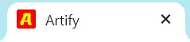
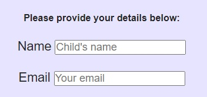

## ARTIFY

The Artify out of school club website displays a landing page for parents looking for a fun out of school art club for their children aged 5 to 11 upon accessing the site. The club offers interesting activities for children to learn new art techniques from a young age and the chance to develop their creative skills.

Users of the site will be able to find all the information needed to know about the clubs on offer including meeting times, pricing a sign up form and the ability to contact the club with any further questions. The site is targeted towards parents of children who want to be creative in a more structured way.

***

## User Stories 
|Story No.|Story|Testing|
| ------------- | ------------- | ------------- |
|1| As a user,   I want to be able to access the site on laptop, tablet and mobile devices   so that I can easily access the site whenever I need to    I know I am done when users can access the site in a range of ways | I tested this by checking this worked in Chrome, explorer, on my ipad, on my phone and on my laptop|
|2|As a user,   I want to be able to recognise the brand easily   so that I know I am viewing the right page for my needs.  I know I am done when users can recognise the site easily through colours, logo and favicons.|
|3|As a user,   I want to be able to navigate the site easily   so that I can find the relevant information I need quickly and efficiently.    I know I am done when users can find different sections of the site with ease.|
|4|As a user  I want to be able to access the site's social media easily   so that I can review the content of the clubs to know their suitability for my needs.     I know I am done when users can view the social media sites easily through icons in the footer.|
|5|As a user,   I want to be able to know what the club offers    so that I can understand whether it is suitable for my needs.     I know I am done when users are provided the information about the club on launching the site. |
|6|As a user,  I want to be able to know the times of clubs.  so that I know if they fit into my schedule.     I know I am done when users can understand the club date, who its provided for and when it's operating. |
|7|As a user,  I want to be able to know the cost of the club    so that I can decide if it's within my budget or not.    I know I am done when users can see the cost of the clubs easily without havinng to search too far. |
|8|As a user,  I want to be able to sign myself up to clubs online.  so that I can sign up at any point that's convenient to myself without having to phone and speak to someone.     I know I am done with users can choose their own clubs, input their name and their email address so that club operators can sign clients up effectively. |
|9|As a user,  I want to be able to make contact with the club    so that I can ask questions about anything which isn't mentioned on the club site.    I know I am done when users can input free text questions or comments and send them directly to the club. |

***

## Wireframe

Below is a design template on how I would like my site to look in an attempt to meet my user stories above.

I have got a clear navigation bar at the top which displays the club logo (so that the brand is easily recognisable) along with different links to press which will take you to different parts of the page.

The sections of the site are clearly defined through the use of colour and borders. 

There are images to go onto the site to show children enjoying the activities they are receiving at the club.

There is a clear sign up section which will give details of the club rota in a table format and then allow adults to submit a form stating which club they would like to sign their child up to.

In the bottom section, there is going to be a freeform text box to allow adults to contact the club should they need further information.

At the very end of the page will be social media links through the use of social media icons which will open in new tabs.

***

## Features

#### Navigation Section

When first loading the page, users are taken to the landing page of the site which is easily identified with the primary colours associated with the children who will be using the clubs.

Other features on the landing page which make the site easily recognisable are features such as the favicon in the browser tab; again in primary colours with a bold icon.

Featured at the top of the page is the navigation bar which shows the club logo in the left corner which links to the top of the page should users need to get back to the top quickly and efficiently.

The other navigation links are on the right: about us, sign up and contact which link to different sections of the same page. These change colour to show which have been selected.

The navigation bar at the top is sectioned off from the different areas below with box shadows and remains present when scrolling the site so that users can easily access the elements they need at all times.

The naviation is in a font that works with the logo font and is replaced with a bouncing pencil image that is clickable and hidden when on smaller device screens. 

The pencil fits with the art club theme and when clicked opens up the navigation menu options to take users to the relevant section they want to know about. The option they choose changes colour when clicked.

#### The about us section

The section gives details about what the club offers their members and has an image of children promoting the club which was taken from Pexels.

The section clearly talks about some of the activities which would be on offer to pupils.

The background colour links to the primary colours associated with the brand and allows you to know you're still in that section and not gone into another.

The heading title also links into the box shadows which identify the start of the section.

#### Sign Up Section

The sign up section starts by having a bold blue box shadow to differentiate it from the previous section and the heading also links to this as it's in the same colour as the box shadow.

The sign up section is laid out in a centralised way and has a range of features within it. 

The section starts off with a table which clearly shows the times and days clubs are run and for which age range so that users can see what's on offer and whether this fits their needs.

Following this there is information which stipulates how long clubs last and the cost of these for participants.
Should users then wish to sign their children up to a particular club, there are input fields where they can place their child's name, the adult's email address and some check boxes to select which date and time they wish to enrol their child on. The input boxes come with prompts as to what users need to input into each field.

#### Contact Us Section

The contact us section also begins with a box shadow and a change of colour to identify the user had moved into a new section.

The title for the section is also in the same colour of the box shadow to add to the style of the site.

The features of the sectin are centralised and with a range of images of children enjoying the activities and themselves at the club. 

Within the section is a contact us box which allows users to contact the club with any queries they may have about the clubs which aren't answered on the site. The text box comes with a prompt as to what users need to input into it.

At the bottom of the section are a range of images. These images are responsive and adapt to different screen sizes in that they reposition themselves on mobile phones, tablets and laptops to look good.

#### Footer
The footer of the page is easily identifiable as it is a dark grey colour and contains the different contrasting logos for social media accounts to allow users to discover more information about the clubs and see more of the activities which children are completing.

The social media logos act as links and take users away from the site by opening the links in new tabs on their laptop or phone browsers.

***

## Testing

#### Manual Testing
- I tested the page works on different browsers including chrome and safari.
- I confirmed the project is responsive and looks good using devtools device toolbar as seen at the start of this readme document.
- I confirmed that the navigation and other sections were all readable and easy to understand.
- I tested that the logo took me back to the top of the page when clicked to ensure users were able to move around the site quickly and easily.
- I tested that the links on the right hand side of the navigation bar took me to the relevant part of the site when clicked.
- I checked that the links in the nav bar changed colour when clicked.
- I tested that the links in the nav bar changed to become a bouncing pencil on smaller devices
- I checked that the bouncing pencil opened up a set of links which users could click and be taken to different sections of the site on smaller devices.
- I have confirmed that input boxes have prompt text to ensure users know how to use them.
- I tested submit buttons worked
- I checked that the check boxes worked and allowed users to select the type of club they wanted to attend
- I have confirmed that the free text box in the contact us section allowed users to type in free text to submit to the site owners.
- I tested that the social media icons in the footer section of the site are working and link to the different social media provider sites.
- I checked that the social media icons opened up in new tabs when they were clicked so that users didn't lose the Artify website they were on.

## validator testing
- html - no errors were returned when passed through the official w3C validator.

- css - no errors were returned when passed through the official jigsaw validator.

- accessibility - I checked that colours and fonts chosen were easy to read and accessible by running it through lighthouse.

## Bugs
when I deployed the project to GitHub Pages I discovered that there were a number of typing errors including / not needed and forms with no closing tags etc.  

I also found that some file names were not useable due to spaces left between words. These have been rectified.

## unfixed bugs
there are no unfixed bugs

## deployment
The site was deployed to github pages
the steps to deploy are as follows:
  - in the github repository click on deployments on the right hand side
  - when the new screen opens click on the open link in new tab button next to the top deployment
a link can be found here 

## credits
### content
the code to make the drop down toggle in the nav bar was taken from the love running project and from notes I had made along the way. 

When coding the site I used a range of websites to troubleshoot problems I came across and ended up typing code from places to see if it worked, I often had to amend this to make it fit my design and ensure it worked for my project. Sites i looked at included w3schools and Stackoverflow. 

### media
the images used on the site were taken from pexels
